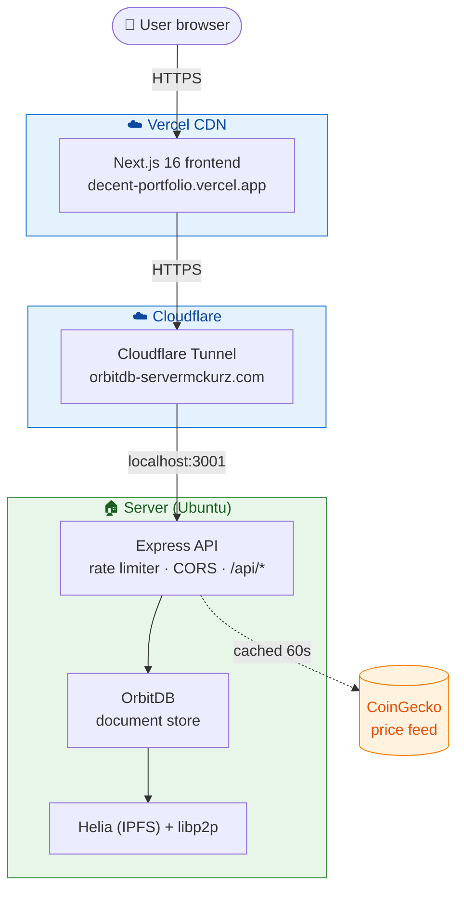

# Decent Portfolio

A peer-to-peer crypto portfolio tracker. The frontend is a normal Next.js app on Vercel, but the database is a [Helia](https://github.com/ipfs/helia) (modern JavaScript IPFS) node running [OrbitDB](https://github.com/orbitdb/orbitdb) on my home server, reachable from the public internet via a Cloudflare Tunnel.

**Live demo:** [decent-portfolio.vercel.app](https://decent-portfolio.vercel.app)


## Why this exists

Position keeping and portfolio reporting are usually centralized for reasons of convenience, not necessity. The records of what someone owns are exactly the kind of thing that can be stored in a content-addressed, cryptographically verifiable structure that the user can host or pin themselves. This app is a small working demonstration of that pattern.

It's also a portfolio piece. The earlier 2022 version (`v1/`) was built on `js-ipfs` and the original OrbitDB. Both have since been rewritten — `js-ipfs` was deprecated in favor of Helia, and `@orbitdb/core` v2 has a meaningfully better API. This repo is the v2 rewrite on the modern stack.

## Architecture



The frontend is just HTML + JS served from Vercel's CDN; it has no special knowledge of IPFS. It talks to the backend over plain HTTPS through the Cloudflare Tunnel, which means HTTPS termination, DDoS protection, and a stable public hostname without exposing any ports on the home machine.

## Stack

**Backend** (`v2-backend/`)
- [`@orbitdb/core`](https://github.com/orbitdb/orbitdb) v2 — peer-to-peer document store with CRDT-based replication
- [`helia`](https://github.com/ipfs/helia) v5 — modern JavaScript IPFS implementation
- [`libp2p`](https://github.com/libp2p/js-libp2p) v2 — peer-to-peer networking layer
- Express + Node 20 — HTTP API the frontend calls
- CoinGecko free tier — price feed, server-side cached for 60s

**Frontend** (`v2-frontend/`)
- Next.js 16 (App Router, Turbopack)
- React 19
- TypeScript (strict mode)
- Tailwind CSS

**Infrastructure**
- Vercel — frontend hosting and CI
- Cloudflare Tunnel — free HTTPS ingress to the server
- A self-hosted Ubuntu box running both the backend and a Solana validator

## Features

- Multi-asset positions (BTC, ZEC, SOL, ETH) with weighted-average cost basis
- Live unrealized PnL per position and portfolio-wide, refreshed every 30s
- Live price ticker with 24h change
- Per-user transaction history (multiple users supported via a User ID field, persisted to localStorage)
- Form-based BUY/SELL entry with client-side validation
- Server-side rate limiting (per-IP sliding window), CORS allowlist, Origin checks on writes

## Running locally

You'll need Node 20.9 or newer.

```bash
# Backend
cd v2-backend
npm install
npm start                # listens on :3001

# Frontend (in a separate terminal)
cd v2-frontend
cp .env.local.example .env.local
npm install
npm run dev              # http://localhost:3000
```

The frontend defaults to talking to `http://localhost:3001`. To point it at the production backend instead, change `NEXT_PUBLIC_API_BASE` in `.env.local`.

OrbitDB persists its data under `v2-backend/data/`. The first run creates a new database; the address is saved to `data/db-address.txt` and reused on subsequent runs.

## API

| Method | Path                  | Notes                                            |
|--------|-----------------------|--------------------------------------------------|
| GET    | `/api/health`         | DB address, version, supported assets            |
| GET    | `/api/prices`         | USD prices for BTC/ZEC/SOL/ETH (cached 60s)      |
| POST   | `/api/add-entry`      | Add a BUY/SELL transaction                       |
| GET    | `/api/query/id?id=…`  | Transactions for a specific user                 |
| GET    | `/api/positions?id=…` | Aggregated positions with live PnL for a user    |

## Design notes

A few things I learned (or relearned the hard way) building this:

- **OrbitDB document queries don't guarantee iteration order.** They iterate the document index, not the operation log. If you aggregate BUY/SELL transactions over a `db.query()` result, you must sort by timestamp first — otherwise SELLs can be applied before their corresponding BUYs and the weighted-average cost basis math goes sideways.
- **Opening an OrbitDB instance by name without a persisted manifest creates a fresh database every restart.** The blocks stay on disk in IPFS but they're orphaned because there's no database pointing at them. The fix is to save the database address to disk on first creation and reopen by address thereafter.
- **The default `IPFSAccessController` only trusts the creating identity.** For a single-node app where the libp2p peer ID regenerates between restarts (the default behavior — we don't persist a keypair), this means every write after the first run gets rejected. For a single-writer app the right setting is `IPFSAccessController({ write: ['*'] })`; for a multi-writer app you want `OrbitDBAccessController` with proper grant/revoke.
- **CoinGecko's free tier is generous but real.** Roughly 5–15 req/min depending on time of day. Server-side caching with a backoff window on 429 is essential.

## Roadmap

- **Wallet-based auth** — sign-in with Ethereum or Solana, replacing the free-text User ID. On-brand for the decentralized identity story.
- **Browser-side Helia peer** — the frontend joins the IPFS swarm directly and reads OrbitDB without going through Express. Removes the home server as a single point of failure (the funniest thing about the current architecture is that an app branded "peer-to-peer" has exactly one point of failure).
- **Portfolio value over time** — historical chart of total portfolio value, using stored snapshots.
- **Transaction edit and delete** — currently transactions are append-only, which is correct for a CRDT but not how users think.
- **WebSocket price feed** — sub-second updates direct from a Binance ticker stream instead of polling CoinGecko.

## Repository layout

```
v2-backend/         # Express API + OrbitDB + Helia (current backend)
v2-frontend/        # Next.js 16 app (current frontend, deployed to Vercel)
front-end/          # v1 Next.js frontend (kept for reference; superseded)
back-end/           # v1 backend
orbitdb-db/         # v1 OrbitDB peer setup
client-alternate/   # earlier v1 experiment
```

The v1 directories are kept for historical context. Everything new goes in `v2-backend/` and `v2-frontend/`.

## License

MIT.


