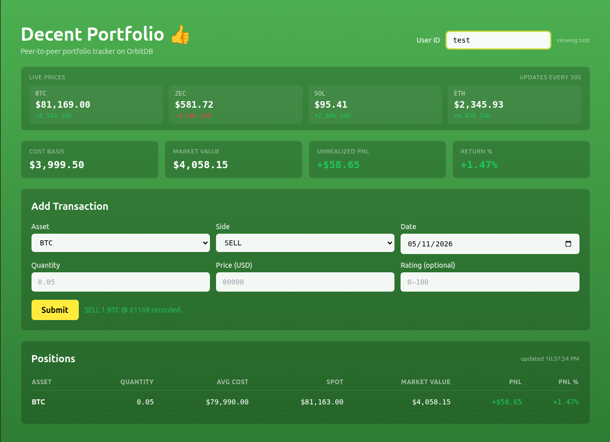
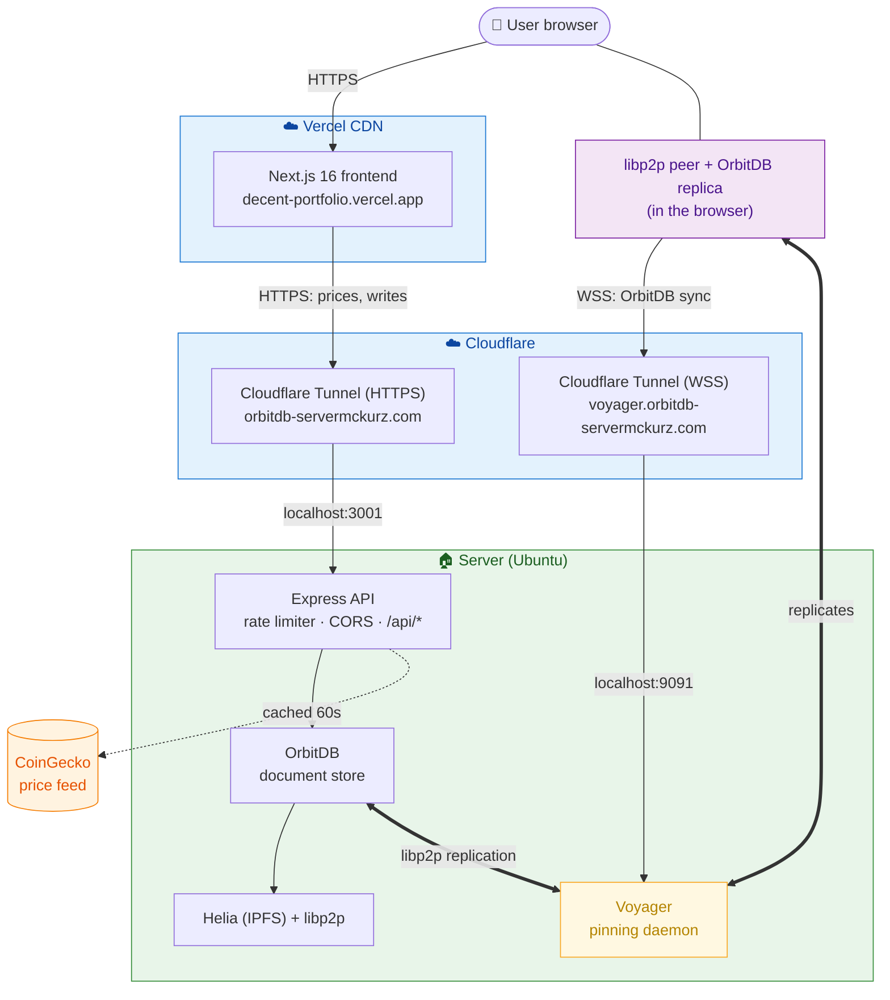

# Decent Portfolio

A peer-to-peer crypto portfolio tracker. The frontend is a normal Next.js app on Vercel, but it runs a real libp2p peer and a local [OrbitDB](https://github.com/orbitdb/orbitdb) replica in the browser — backed by a [Helia](https://github.com/ipfs/helia) (modern JavaScript IPFS) node and a [Voyager](https://github.com/orbitdb/voyager) pinning peer in a small homelab, reachable from the public internet via Cloudflare Tunnel.

**Live demo:** [decent-portfolio.vercel.app](https://decent-portfolio.vercel.app)



## Why this exists

Position keeping and portfolio reporting are usually centralized for reasons of convenience, not necessity. The records of what someone owns are exactly the kind of thing that can be stored in a content-addressed, cryptographically verifiable structure that the user can host or pin themselves. This app is a small working demonstration of that pattern.

It's also a portfolio piece. The earlier 2022 version (`v1/`) was built on `js-ipfs` and the original OrbitDB. Both have since been rewritten — `js-ipfs` was deprecated in favor of Helia, and `@orbitdb/core` v2 has a meaningfully better API. This repo is the v2 rewrite on the modern stack.

## Architecture



The frontend is served from Vercel's CDN, but the browser does more than just render HTML — it runs a real libp2p peer and a local OrbitDB replica. Positions are read directly from the in-browser database. Prices and writes still go through Express over HTTPS, since CoinGecko's API key lives server-side and writes need server-validated rate limiting.

**The OrbitDB database is replicated to three places:** the Express server (which serves writes), a local Voyager pinning peer (always-on, the architectural backbone), and every browser that loads the app (transient replicas that come and go with each session). Both kinds of replication happen over libp2p. The Cloudflare Tunnel exposes two ingresses: HTTPS for the Express API and WSS for the Voyager WebSocket endpoint so browsers can dial it from the public internet.

The backend runs on one box in a small homelab in my basement, alongside a few other machines doing unrelated things (a self-hosted Solana validator, among others).

## Stack

**Backend** (`v2-backend/`)
- [`@orbitdb/core`](https://github.com/orbitdb/orbitdb) v2 — peer-to-peer document store with CRDT-based replication
- [`helia`](https://github.com/ipfs/helia) v5 — modern JavaScript IPFS implementation
- [`libp2p`](https://github.com/libp2p/js-libp2p) v2 — peer-to-peer networking layer
- [`@orbitdb/voyager`](https://github.com/orbitdb/voyager) — always-on pinning peer that replicates the database
- Express + Node 20 — HTTP API the frontend calls
- CoinGecko free tier — price feed, server-side cached for 60s

**Frontend** (`v2-frontend/`)
- Next.js 16 (App Router, Turbopack)
- React 19
- TypeScript (strict mode)
- Tailwind CSS
- [`@orbitdb/core`](https://github.com/orbitdb/orbitdb), [`helia`](https://github.com/ipfs/helia), and [`libp2p`](https://github.com/libp2p/js-libp2p) — same stack as the backend, now running in the browser

**Infrastructure**
- Vercel — frontend hosting and CI
- Cloudflare Tunnel — free HTTPS/WSS ingress to the homelab
- A small homelab in my basement, hosting the backend alongside other unrelated infrastructure

## Features

- Multi-asset positions (BTC, ZEC, SOL, ETH) with weighted-average cost basis
- Live unrealized PnL per position and portfolio-wide, refreshed every 30s
- Live price ticker with 24h change
- Per-user transaction history (multiple users supported via a User ID field, persisted to localStorage)
- Form-based BUY/SELL entry with client-side validation
- Server-side rate limiting (per-IP sliding window), CORS allowlist, Origin checks on writes
- Browser-side OrbitDB replica — positions read from local data, not from the server

## Running locally

You'll need Node 20.9 or newer.

```bash
# Backend
cd v2-backend
npm install
npm start                # listens on :3001

# Frontend (in a separate terminal)
cd v2-frontend
cp .env.local.example .env.local
npm install
npm run dev              # http://localhost:3000
```

The frontend defaults to talking to `http://localhost:3001`. To point it at the production backend instead, change `NEXT_PUBLIC_API_BASE` in `.env.local`.

OrbitDB persists its data under `v2-backend/data/`. The first run creates a new database; the address is saved to `data/db-address.txt` and reused on subsequent runs.

## API

| Method | Path                  | Notes                                            |
|--------|-----------------------|--------------------------------------------------|
| GET    | `/api/health`         | DB address, version, supported assets            |
| GET    | `/api/prices`         | USD prices for BTC/ZEC/SOL/ETH (cached 60s)      |
| POST   | `/api/add-entry`      | Add a BUY/SELL transaction                       |
| GET    | `/api/query/id?id=…`  | Transactions for a specific user                 |
| GET    | `/api/positions?id=…` | Aggregated positions with live PnL for a user    |

With the browser-side replica active, `/api/positions` and `/api/query/id` are typically *not* hit — the frontend reads from local OrbitDB instead. They remain available as a fallback for clients that can't establish a WebSocket connection to Voyager (corporate firewalls, restrictive networks).

## Design notes

A few things I learned (or relearned the hard way) building this:

- **OrbitDB document queries don't guarantee iteration order.** They iterate the document index, not the operation log. If you aggregate BUY/SELL transactions over a `db.query()` result, you must sort by timestamp first — otherwise SELLs can be applied before their corresponding BUYs and the weighted-average cost basis math goes sideways.
- **Opening an OrbitDB instance by name without a persisted manifest creates a fresh database every restart.** The blocks stay on disk in IPFS but they're orphaned because there's no database pointing at them. The fix is to save the database address to disk on first creation and reopen by address thereafter.
- **The default `IPFSAccessController` only trusts the creating identity.** For a single-node app where the libp2p peer ID regenerates between restarts (the default behavior — we don't persist a keypair), this means every write after the first run gets rejected. For a single-writer app the right setting is `IPFSAccessController({ write: ['*'] })`; for a multi-writer app you want `OrbitDBAccessController` with proper grant/revoke.
- **CoinGecko's free tier is generous but real.** Roughly 5–15 req/min depending on time of day. Server-side caching with a backoff window on 429 is essential.
- **Helia's libp2p defaults statically import `@libp2p/webrtc`,** which transitively pulls in `node-datachannel` — a Node-only native module that breaks browser bundlers. Stubbing the WebRTC imports via Turbopack's `resolveAlias` to a no-op module gets past this, since we only use WebSockets to dial Voyager.
- **Helia, libp2p, and OrbitDB must be dynamically imported on the client side in Next.js.** Top-level static imports trigger SSR loading of native dependencies like `classic-level`, which fails at build time. Wrapping the imports in `await import()` inside a `typeof window !== 'undefined'` guard fixes it.
- **The libp2p WebSocket multiaddr format for browsers is `/dns4/host/tcp/443/tls/ws/p2p/<peerId>`,** not `/dns4/host/tcp/443/wss/p2p/<peerId>`. The `/wss` form parses without error but the dial fails silently — `/tls/ws` is the correct compositional form for libp2p v2.x.
- **Cloudflared reads `/etc/cloudflared/config.yml` when installed as a system service,** not `~/.cloudflared/config.yml`. Editing the user-home config will look successful (no syntax errors) but have no effect on the running daemon.

## Roadmap

- **Wallet-based auth** — sign-in with Ethereum or Solana, replacing the free-text User ID. On-brand for the decentralized identity story, and load-bearing for the user-owned databases below.
- **User-owned databases** — today everyone reads the same OrbitDB instance. Next is letting each user own their own database, with the server-side writer acting on delegated authority. This is the natural Phase C of the decentralization story.
- **Portfolio value over time** — historical chart of total portfolio value, using stored snapshots.
- **Transaction edit and delete** — currently transactions are append-only, which is correct for a CRDT but not how users think.
- **WebSocket price feed** — sub-second updates direct from a Binance ticker stream instead of polling CoinGecko.

## Repository layout

```
v2-backend/         # Express API + OrbitDB + Helia + Voyager (current backend)
v2-frontend/        # Next.js 16 app with browser-side OrbitDB (current frontend, deployed to Vercel)
front-end/          # v1 Next.js frontend (kept for reference; superseded)
back-end/           # v1 backend
orbitdb-db/         # v1 OrbitDB peer setup
client-alternate/   # earlier v1 experiment
```

The v1 directories are kept for historical context. Everything new goes in `v2-backend/` and `v2-frontend/`.

## License

MIT.


